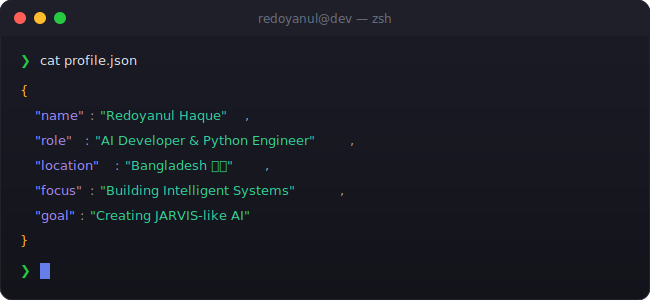

<!-- 
╔══════════════════════════════════════════════════════════════════════════════╗
║                                                                              ║
║      █████╗ ███╗   ███╗ █████╗ ███╗   ██╗    ██████╗ ███████╗███████╗██████╗ ║
║     ██╔══██╗████╗ ████║██╔══██╗████╗  ██║    ██╔══██╗██╔════╝██╔════╝██╔══██╗║
║     ███████║██╔████╔██║███████║██╔██╗ ██║    ██║  ██║█████╗  █████╗  ██████╔╝║
║     ██╔══██║██║╚██╔╝██║██╔══██║██║╚██╗██║    ██║  ██║██╔══╝  ██╔══╝  ██╔═══╝ ║
║     ██║  ██║██║ ╚═╝ ██║██║  ██║██║ ╚████║    ██████╔╝███████╗███████╗██║     ║
║     ╚═╝  ╚═╝╚═╝     ╚═╝╚═╝  ╚═╝╚═╝  ╚═══╝    ╚═════╝ ╚══════╝╚══════╝╚═╝     ║
║                                                                              ║
║          🛰️ SOFTWARE ENGINEER • ARCHITECT • MASTER WHAT IS CHOSEN 🛰️         ║
║                                                                              ║
╚══════════════════════════════════════════════════════════════════════════════╝
-->

<div align="center">
  
  <!-- ═══════════════════════════════════════════════════════════════════════════ -->
  <!-- 🎯 ANIMATED HEADER                                                          -->
  <!-- ═══════════════════════════════════════════════════════════════════════════ -->
  
  
  
  <br/>
  
  <!-- ═══════════════════════════════════════════════════════════════════════════ -->
  <!-- 📊 PROFILE BADGES                                                           -->
  <!-- ═══════════════════════════════════════════════════════════════════════════ -->
  
  <a href="https://github.com/aman-sharma19">
    
  </a>
  &nbsp;
  <a href="https://github.com/aman-sharma19?tab=repositories">
    
  </a>
  &nbsp;
  <a href="https://github.com/aman-sharma19?tab=followers">
    
  </a>
  &nbsp;
  <a href="https://github.com/aman-sharma19">
    
  </a>
  
</div>

<br/>

<!-- ═══════════════════════════════════════════════════════════════════════════ -->
<!-- 🖥️ TERMINAL INTRO SECTION                                                   -->
<!-- ═══════════════════════════════════════════════════════════════════════════ -->

<div align="center">
  
</div>

<br/>


<br/>

<!-- ═══════════════════════════════════════════════════════════════════════════ -->
<!-- 👤 ABOUT ME SECTION                                                          -->
<!-- ═══════════════════════════════════════════════════════════════════════════ -->


<br/><br/>

<table>
<tr>
<td width="55%" valign="top">

### 🎯 What I Do

```yaml
name: Aman Deep Sharma
located_in: New Delhi, India 🇮🇳
current_status: Software Engineer

areas_of_expertise:
  - 🚀 Backend & Core Logic (PHP, Laravel, Symfony)
  - 🪐 Frontend & UI (React, Next.js, JavaScript)
  - ☄️ E-Commerce Ecosystems (Bagisto, QloApps, Shopify, Odoo)
  - 🟢 Node.js & Go Services
  - ☁️ Cloud-Native Architectures

current_coordinates:
  - Navigating through Cloud-Native Galaxies
  - Engineering scalable backend experiences
  - Deepening mastery of chosen stacks

life_philosophy: "Master what is chosen."
```

</td>
<td width="45%" valign="top">

### 🚀 Mission Log

- 🔭 **Engineering** scalable backend systems
- 🏗️ **Architecting** full-stack web platforms
- 🛒 **Building** robust e-commerce solutions
- 🌟 **Contributing** to open-source
- 📚 **Mastering** the architectures I build
- ⚡ **Core Directive:** "Master what is chosen."

<br/>

### 💡 Quick Facts

- 🎓 Engineer's mindset, architect's eye
- 🔥 Passionate about clean, scalable systems
- 🌱 Always learning new technologies
- ☕ Fueled by curiosity & high-octane coffee

</td>
</tr>
</table>

<br/>


<br/>

<!-- ═══════════════════════════════════════════════════════════════════════════ -->
<!-- 🎮 CONTRIBUTION SHOWCASE                                                    -->
<!-- ═══════════════════════════════════════════════════════════════════════════ -->


<br/><br/>

<div align="center">
  
  <!-- Pac-Man Contribution Graph -->
  <picture>
    <source media="(prefers-color-scheme: dark)" srcset="./assets/pacman-contribution-graph-dark.svg"/>
    <source media="(prefers-color-scheme: light)" srcset="./assets/pacman-contribution-graph.svg"/>
    
  </picture>
  
  <br/>
  
  <sub>👾 Watch Pac-Man devour my contributions!</sub>
  
</div>

<br/>


<br/>

<!-- ═══════════════════════════════════════════════════════════════════════════ -->
<!-- ⚡ TECH STACK                                                               -->
<!-- ═══════════════════════════════════════════════════════════════════════════ -->


<br/><br/>

<div align="center">

<!-- 💻 LANGUAGES -->
<h4>💻 Languages</h4>
<p>
  <a href="https://www.php.net/" target="_blank"></a>
  <a href="https://developer.mozilla.org/en-US/docs/Web/JavaScript" target="_blank"></a>
  <a href="https://www.typescriptlang.org/" target="_blank"></a>
  <a href="https://go.dev/" target="_blank"></a>
  <a href="https://www.gnu.org/software/bash/" target="_blank"></a>
</p>

<!-- 🚀 BACKEND & FRAMEWORKS -->
<h4>🚀 Backend & Core Logic</h4>
<p>
  <a href="https://laravel.com/" target="_blank"></a>
  <a href="https://symfony.com/" target="_blank"></a>
  <a href="https://nodejs.org/" target="_blank"></a>
  <a href="https://expressjs.com/" target="_blank"></a>
</p>

<!-- 🪐 FRONTEND & UI -->
<h4>🪐 Frontend & UI</h4>
<p>
  <a href="https://reactjs.org/" target="_blank"></a>
  <a href="https://nextjs.org/" target="_blank"></a>
  <a href="https://tailwindcss.com/" target="_blank"></a>
  <a href="https://developer.mozilla.org/en-US/docs/Web/HTML" target="_blank"></a>
  <a href="https://developer.mozilla.org/en-US/docs/Web/CSS" target="_blank"></a>
</p>

<!-- ☄️ ECOSYSTEMS & E-COMMERCE -->
<h4>☄️ Ecosystems & E-Commerce</h4>
<p>
  
  
  
  
</p>

<!-- 🗄️ DATABASES -->
<h4>🗄️ Databases</h4>
<p>
  <a href="https://www.mongodb.com/" target="_blank"></a>
  <a href="https://www.postgresql.org/" target="_blank"></a>
  <a href="https://www.mysql.com/" target="_blank"></a>
  <a href="https://redis.io/" target="_blank"></a>
  <a href="https://firebase.google.com/" target="_blank"></a>
  <a href="https://www.sqlite.org/" target="_blank"></a>
</p>

<!-- 🔧 TOOLS & PLATFORMS -->
<h4>🔧 Tools & Platforms</h4>
<p>
  <a href="https://git-scm.com/" target="_blank"></a>
  <a href="https://www.docker.com/" target="_blank"></a>
  <a href="https://www.linux.org/" target="_blank"></a>
  <a href="https://code.visualstudio.com/" target="_blank"></a>
  <a href="https://azure.microsoft.com/" target="_blank"></a>
  <a href="https://vercel.com/" target="_blank"></a>
  <a href="https://www.figma.com/" target="_blank"></a>
  <a href="https://www.postman.com/" target="_blank"></a>
</p>

</div>

<br/>


<br/>

<!-- ═══════════════════════════════════════════════════════════════════════════ -->
<!-- 🌐 CONNECT WITH ME                                                          -->
<!-- ═══════════════════════════════════════════════════════════════════════════ -->


<br/><br/>

<div align="center">
  
<a href="https://github.com/aman-sharma19" target="_blank">
  
</a>
&nbsp;
<a href="https://www.linkedin.com/in/aman-deep-sharma-9944521a2/" target="_blank">
  
</a>
&nbsp;
<a href="mailto:sharma.ammy2002@gmail.com">
  
</a>

</div>

<br/>


<br/>

<!-- ═══════════════════════════════════════════════════════════════════════════ -->
<!-- 💡 RANDOM DEV QUOTE                                                         -->
<!-- ═══════════════════════════════════════════════════════════════════════════ -->

<div align="center">
  
### 💭 Random Dev Quote

<br/>


</div>

<br/>

<!-- ═══════════════════════════════════════════════════════════════════════════ -->
<!-- 🌟 FOOTER                                                                   -->
<!-- ═══════════════════════════════════════════════════════════════════════════ -->

<div align="center">
  
  
  
  <br/>
  
  
  
</div>

<!-- ═══════════════════════════════════════════════════════════════════════════ -->
<!-- 📝 END OF README                                                            -->
<!-- ═══════════════════════════════════════════════════════════════════════════ -->